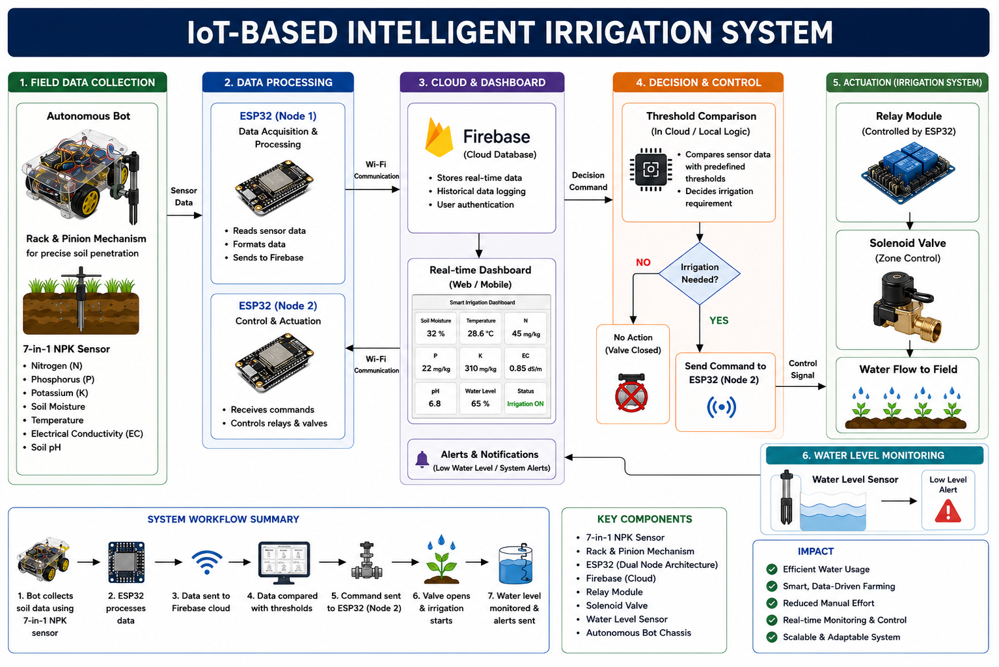
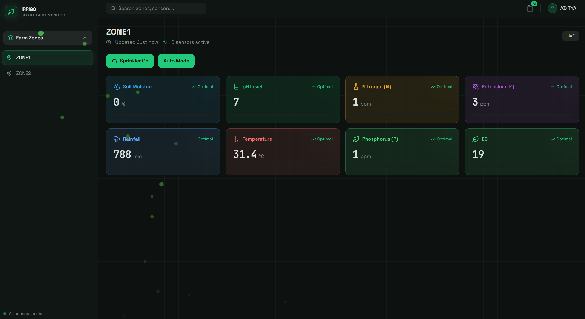
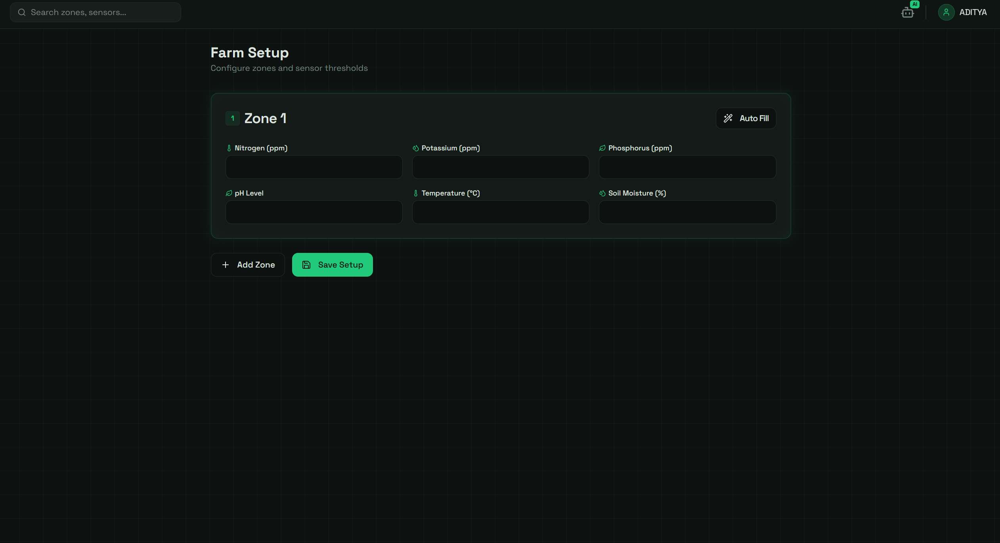

<h1 align="center">🌱 IoT-Based Autonomous Precision Irrigation System</h1>

<h3 align="center">
Smart Agriculture • IoT • ESP32 • Firebase • Machine Learning • Embedded Systems
</h3>

<p align="center">
An Intelligent Precision Farming Solution developed by <b>Team IRRIGO</b>
</p>

<p align="center">


</p>

---

# 🌐 Live Demo

<p align="center">

<a href="https://irrigo-3-0.vercel.app/auth">

</a>

</p>

## 🔗 Website

https://irrigo-3-0.vercel.app/auth

---

# 📖 Overview

**IRRIGO** is an **IoT-Based Autonomous Precision Irrigation System** designed to optimize water usage through intelligent sensing, cloud connectivity, embedded systems, and automation.

Unlike traditional irrigation systems that uniformly water an entire field, IRRIGO divides farmland into multiple irrigation zones and continuously monitors each zone using an autonomous robotic rover equipped with an industrial-grade **7-in-1 Soil NPK Sensor**.

The collected soil data is transmitted via **ESP32** to **Firebase Realtime Database**, where the backend processes the information and determines irrigation requirements. Whenever a particular zone requires water, the respective ESP32 node automatically activates the solenoid valve, ensuring **precision irrigation** while minimizing water wastage.

The project combines Robotics, Embedded Systems, IoT, Cloud Computing, Machine Learning, and Web Technologies into a complete Smart Agriculture ecosystem.

---

# 🏆 HACKSAGON 2026 Achievement

<p align="center">

</p>

## 🥇 TOP PERFORMERS

🏆 National Level Software & Hardware Hackathon

**Competition**
HACKSAGON 2026

**Track**
Agritech & Rural Innovation

**Category**
Hardware + Software

Our project was recognized among the **Top Performing Teams** for developing an intelligent autonomous irrigation platform capable of optimizing water usage using Robotics, IoT, Embedded Systems and Machine Learning.

---

# 🏗️ System Architecture

<p align="center">

</p>

The complete workflow consists of six intelligent modules:

- 🌱 Autonomous Soil Data Collection
- ⚡ ESP32 Data Processing
- ☁ Firebase Cloud Database
- 🤖 Machine Learning Decision Engine
- 💧 Automatic Irrigation Control
- 📊 Live Dashboard Monitoring

---

# 📸 Project Gallery

## 🌱 Complete Working Prototype

<p align="center">

</p>

The hardware prototype integrates

- Autonomous Robot
- Dual ESP32 Nodes
- Industrial NPK Sensor
- Relay Module
- Solenoid Valves
- Water Tank
- Irrigation Zones
- Firebase Connectivity

---

## 🤖 Autonomous Soil Sampling Rover

<p align="center">

</p>

### Robot Features

- 4WD Autonomous Rover
- Rack & Pinion Sensor Deployment
- ESP32 Controller
- Industrial 7-in-1 Soil NPK Sensor
- Real-Time Data Acquisition
- Wireless Communication

---

# 💻 Smart Web Dashboard

## 📊 Live Monitoring Dashboard

<p align="center">

</p>

The dashboard provides

- Live Soil Moisture Monitoring
- Temperature Monitoring
- pH Analysis
- Nitrogen, Phosphorus & Potassium Levels
- Electrical Conductivity
- Rainfall Data
- Auto/Manual Irrigation Control
- Zone-wise Monitoring
- Real-Time Firebase Synchronization

---

## ⚙ Farm Configuration Dashboard

<p align="center">

</p>

Farm managers can

- Create Multiple Irrigation Zones
- Configure Crop Parameters
- Set Threshold Values
- Add New Zones
- Save Farm Configurations
- Auto-fill Sensor Values
- Manage Precision Irrigation Settings

---

# 🎯 Problem Statement

Traditional irrigation systems suffer from

- Water Wastage
- Manual Irrigation
- Over-Irrigation
- Under-Irrigation
- Lack of Real-Time Monitoring
- Uniform Water Distribution
- High Labour Dependency

This results in reduced agricultural productivity and inefficient utilization of available water resources.

---

# 💡 Our Solution

IRRIGO solves these challenges through an intelligent autonomous irrigation platform.

The autonomous rover periodically collects soil parameters from different farming zones using an industrial-grade 7-in-1 NPK Sensor.

Collected sensor values are uploaded to Firebase using ESP32, where Machine Learning algorithms determine whether irrigation is required.

If the moisture level falls below the optimal threshold for the selected crop, ESP32 activates the corresponding relay module, opening only the required solenoid valve.

This enables

- 💧 Precision Irrigation
- 🌱 Healthy Crop Growth
- 📈 Better Yield
- 🚜 Smart Farming
- 🌍 Water Conservation
- 🤖 Fully Automated Irrigation

---

# ⚙ Working Principle

### Step 1

The autonomous rover navigates to predefined farming zones.

↓

### Step 2

Rack & Pinion mechanism inserts the industrial 7-in-1 Soil NPK Sensor into the soil.

↓

### Step 3

ESP32 collects

- Nitrogen
- Phosphorus
- Potassium
- Soil Moisture
- Temperature
- Soil pH
- Electrical Conductivity

↓

### Step 4

Sensor readings are uploaded to Firebase Realtime Database.

↓

### Step 5

The backend compares the live values with crop-specific moisture thresholds generated using Machine Learning.

↓

### Step 6

If irrigation is required, the respective ESP32 node activates the relay module.

↓

### Step 7

The corresponding solenoid valve opens automatically.

↓

### Step 8

Only the required farming zone receives water.

↓

### Step 9

The dashboard updates in real time, providing live monitoring and complete farm visibility.

---
# ✨ Key Features

- 🤖 Autonomous Soil Sampling Rover
- 🌱 Precision Irrigation using Soil Health Data
- 📡 Dual ESP32 Node Architecture
- ☁️ Firebase Realtime Database Integration
- 📊 Real-Time Smart Dashboard
- 🤖 Machine Learning Based Irrigation Decision
- 💧 Automatic Solenoid Valve Control
- 🌦️ Water Level Monitoring & Alerts
- 📈 Historical Sensor Data Logging
- 🌍 Water Conservation through Zone-wise Irrigation
- ⚡ Wireless Communication between Nodes
- 📱 Responsive Web Dashboard
- 🔄 Auto & Manual Irrigation Modes
- 🚜 Modular and Scalable Architecture

---

# 🛠️ Technology Stack

## 💻 Software

| Technology | Purpose |
|------------|---------|
| HTML5 | Dashboard UI |
| CSS3 | Styling |
| JavaScript | Frontend Logic |
| Python | Backend & ML Processing |
| Flask / FastAPI | REST API |
| Firebase Realtime Database | Cloud Database |
| Machine Learning | Irrigation Decision |
| Arduino IDE | ESP32 Programming |
| Git & GitHub | Version Control |

---

## 🔩 Hardware Components

| Component | Description |
|------------|-------------|
| ESP32 Development Board | Main Controller |
| ESP32 Node-2 | Valve Controller |
| Industrial 7-in-1 Soil NPK Sensor | Soil Analysis |
| MAX485 Module | RS485 Communication |
| Relay Module | Switching Solenoid Valve |
| Solenoid Valve | Water Flow Control |
| Water Level Sensor | Tank Monitoring |
| 4WD Robot Chassis | Autonomous Navigation |
| Rack & Pinion Mechanism | Sensor Deployment |
| Motor Driver | Robot Motion |
| Battery Pack | Power Supply |

---

# 📂 Repository Structure

```text
IRRIGO/

├── Arduino_Code/
│   ├── Node1/
│   ├── Node2/
│
├── Backend/
│   ├── API/
│   ├── Firebase/
│   ├── ML/
│
├── Frontend/
│   ├── HTML/
│   ├── CSS/
│   ├── JavaScript/
│
├── Documentation/
│
├── Hardware/
│
├── Images/
│   ├── architecture.png
│   ├── prototype.jpg
│   ├── robot.jpg
│   ├── dashboard.png
│   ├── farm-setup.png
│   ├── certificate.jpg
│   └── team.jpg
│
└── README.md
```

---

# 🔄 System Workflow

```text
Autonomous Robot
        │
        ▼
7-in-1 Soil NPK Sensor
        │
        ▼
ESP32 (Node-1)
        │
        ▼
Firebase Realtime Database
        │
        ▼
Machine Learning Decision Engine
        │
        ▼
ESP32 (Node-2)
        │
        ▼
Relay Module
        │
        ▼
Solenoid Valve
        │
        ▼
Precision Irrigation
        │
        ▼
Live Dashboard Update
```

---

# 🚀 Installation

## Clone Repository

```bash
git clone https://github.com/yourusername/IRRIGO-HACKSAGON-2026.git
```

---

## Backend

```bash
cd Backend

pip install -r requirements.txt

python app.py
```

---

## Frontend

Simply open

```
index.html
```

or deploy using

- Vercel
- Netlify

---

## ESP32

Upload the Arduino firmware using

- Arduino IDE

Configure

- WiFi Credentials
- Firebase API Key
- Firebase Database URL

Upload code to both ESP32 nodes.

---

# 🌍 Live Website

### 🚀 Smart Farm Dashboard

https://irrigo-3-0.vercel.app/auth

---

# 🎥 Project Demonstration

### Features Demonstrated

✔ Autonomous Robot Navigation

✔ Rack & Pinion Soil Sampling

✔ Industrial NPK Sensor

✔ Firebase Synchronization

✔ Real-Time Dashboard

✔ Automatic Irrigation

✔ Smart Decision Making

✔ Live Monitoring

---

# 📈 Future Enhancements

- 🌤 Weather Forecast Integration
- 🛰 GPS Based Autonomous Navigation
- 🚁 Drone Assisted Crop Monitoring
- 🌾 AI Based Crop Recommendation
- 📱 Android Application
- ☀ Solar Powered Charging Station
- 📍 GIS Farm Mapping
- 📡 LoRa Communication
- 🤖 Edge AI Processing
- 🌍 Multi-Farm Management

---

# 📊 Project Highlights

- 🌱 Smart Agriculture
- 🤖 Robotics
- 📡 Internet of Things
- ⚡ Embedded Systems
- 💧 Precision Irrigation
- ☁ Cloud Computing
- 🤖 Machine Learning
- 🌍 Sustainable Farming
- 📈 Data Analytics
- 🚜 Automation

---

# 👨‍💻 Team IRRIGO

<p align="center">

</p>

| Member | Role |
|---------|------|
| **Aditya Pratap Singh** | **Team Lead • Robotics • IoT • Embedded Systems • System Integration** |
| Piyush Sharma | Backend Development & Cloud Integration |
| Aryan Kumar | Embedded Systems & Hardware Development |
| Indrani Rabha | Dashboard, Documentation & Testing |

---

# 🏆 Recognition

🥇 **TOP PERFORMERS**

**HACKSAGON 2026**

Agritech & Rural Innovation Track

National Level Software & Hardware Hackathon

---

# 🙏 Acknowledgements

We sincerely thank

- 🏛 ABV-IIITM Gwalior
- 📡 IEEE Student Branch
- 🏆 HACKSAGON 2026 Organizing Committee
- 👨‍🏫 Judges & Mentors
- 🌱 National Institute of Technology Silchar

for providing us the opportunity to showcase our innovation and encouraging us to build impactful solutions for sustainable agriculture.

---

# 📬 Contact

### Team Lead

**Aditya Pratap Singh**

🎓 B.Tech Electronics & Communication Engineering

National Institute of Technology Silchar

📧 Email: adityaps_ug_24@ece.nits.ac.in

💼 LinkedIn: *(Add your profile link)*

🐙 GitHub: https://github.com/Aditya-code-ai

---

# ⭐ Support

If you found this project useful,

⭐ Star this repository

🍴 Fork this project

💬 Share your feedback

🌱 Let's build a smarter future for agriculture together!

---

<p align="center">

## 🌱 Team IRRIGO

### "Empowering Agriculture through Robotics, IoT & Artificial Intelligence"

Made with ❤️ by **Team IRRIGO**

**Team Lead:** **Aditya Pratap Singh**

🏆 HACKSAGON 2026 • Top Performers

</p>
